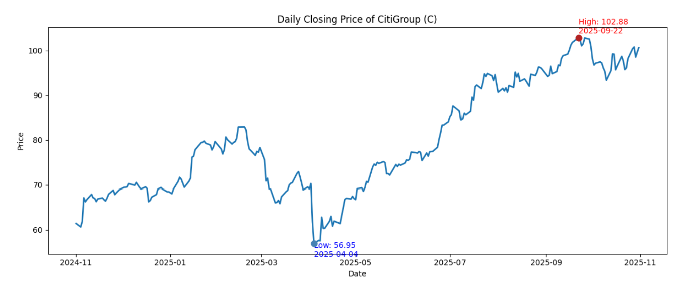

# Citigroup Stock Price Analysis: Financial Sector Predictive Modeling

Predictive analysis of Citigroup (C) stock performance using SAS and Python. Built a multi-stage regression model explaining 98.3% of price variance (Adj R² = 0.983), applying Pearson correlation screening, stepwise selection, and VIF diagnostics to resolve multicollinearity. Includes interaction modeling, quadratic terms, and full residual diagnostics.


*Citigroup daily closing price Nov 2024 – Oct 2025 — low of $56.95 in April, recovery to $102.88 by September*

---

## Executive Summary

This project identifies the key drivers of Citigroup's daily stock price movements relative to the S&P 500 Financial Sector. Using SAS for statistical modeling and Python for exploratory data analysis, I built a regression model that explains 98.3% of Citigroup's daily price variation using a focused set of financial sector peers.

## Tech Stack & Methodology

**Languages:** Python (Pandas, Seaborn, Matplotlib), SAS
**Statistical Techniques:** Pearson Correlation, Stepwise Regression, Multicollinearity Diagnostics (VIF), Interaction Terms, Quadratic Terms, Residual Analysis
**Data Source:** Daily closing prices for S&P 500 financial-sector companies (250 trading days, Nov 2024 – Oct 2025)

---

## Methodology Overview

The analysis followed a structured, multi-stage variable selection process to move from 74 raw predictors down to a final interpretable model.


*Daily price trends grouped by sector — Investment Banking, Diversified Banks, Consumer Finance, Asset Management, Financial Exchange & Data, and Insurance*

The sector grouping step was critical: it revealed that insurance stocks diverge from Citigroup's trend despite having moderate correlation, leading to their removal before modeling.


*Correlation matrix across 19 selected predictors — strong positive clustering among banking and consumer finance stocks, ERIE showing a clear negative relationship*

---

## Key Findings

- **Variable selection:** Narrowed 74 potential predictors down to 4 final variables (BAC, COF, BK, BLK) through correlation screening, stepwise regression, and iterative VIF diagnostics
- **Multicollinearity resolution:** Removed high-VIF predictors including GS and IBKR, and flagged BEN for sign reversal — a classic indicator of collinearity despite low VIF
- **Interaction effects:** Discovered significant pairwise interactions (BAC×COF, BAC×BK, BAC×BLK, COF×BK, BK×BLK), meaning the effect of one predictor on Citigroup's price varies depending on the price level of another
- **Non-linearity:** Found a significant quadratic term for BK, indicating diminishing marginal effect at higher price levels
- **Sector insight:** Insurance stocks (HIG, TRV, WRB, ERIE, GL) were excluded after EDA revealed their trend behavior diverges from Citigroup despite moderate correlation — a reflection of their fundamentally different business models

---

## Final Model
```
Predicted C = 36.54 + 5.367(BAC) - 0.386(COF) - 3.752(BK) + 0.139(BLK)
            - 0.0137(BK²) + 0.0274(BAC×COF) + 0.046(BAC×BK)
            - 0.01418(BAC×BLK) - 0.00725(COF×BK) + 0.00580(BK×BLK)

Adj R² = 0.9834 | Root MSE = 1.604 | CV = 2.012%
```


*Residual vs predicted, Q-Q plot, fit-spread plot, and residual distribution — all assumptions reasonably satisfied*


*Interaction effect plots showing non-parallel lines across all predictor pairs — confirming the significance of interaction terms*

---

## How to Navigate this Repo

- `Financial_Market_Analysis_EDA.ipynb` — Python EDA: time series trends, sector groupings, correlation heatmap, distribution plots
- `analysis.sas` — Full SAS workflow: correlation analysis, stepwise regression, VIF diagnostics, interaction modeling, residual diagnostics
- `Predictive Financial Modeling Report.pdf` — Complete 30-page report with all outputs, diagnostic plots, and interpretation
- `Stock Closing Prices.xlsx` — Daily closing price data for all S&P 500 financial sector components
- `S&P 500 Components.xlsx` — Reference file for sector classifications used in grouping
